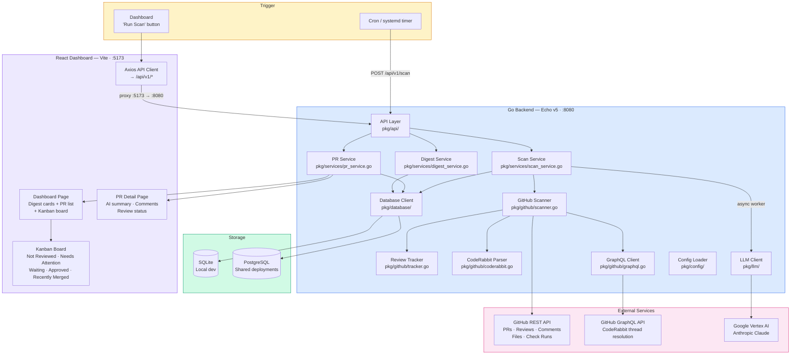
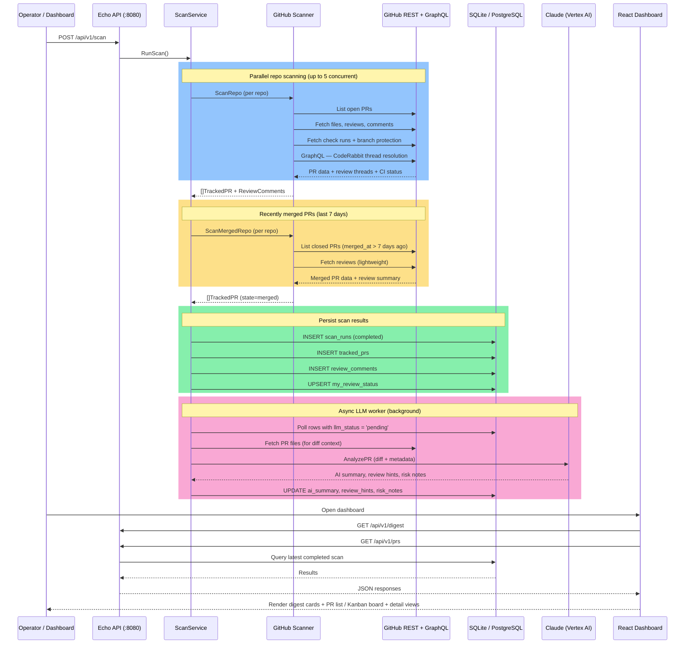
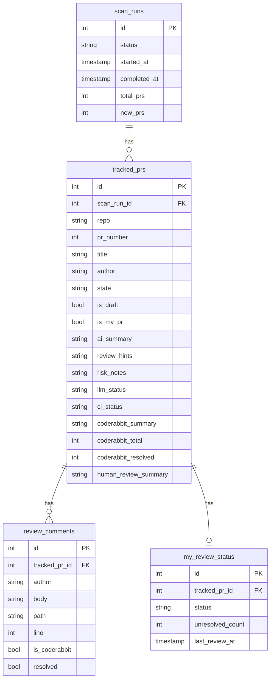

# PR Scout — Architecture

## High-Level Overview



## Scan Data Flow

End-to-end sequence from triggering a scan to rendering results on the dashboard:



## Package Structure

```
pr-scout/
├── cmd/pr-scout/
│   └── main.go              ← Entry point: wiring, server start, graceful shutdown
├── pkg/
│   ├── api/
│   │   ├── server.go        ← Echo router, CORS, static SPA serving
│   │   ├── handler_scan.go  ← POST /api/v1/scan
│   │   ├── handler_prs.go   ← GET /api/v1/prs, /api/v1/prs/:id
│   │   ├── handler_digest.go← GET /api/v1/digest
│   │   └── responses.go     ← Shared JSON response types
│   ├── config/
│   │   └── config.go        ← YAML + .env loading, defaults, DB env overrides
│   ├── database/
│   │   ├── client.go        ← SQLite/PostgreSQL connect + golang-migrate
│   │   └── migrations/      ← Embedded SQL migrations (4 versions)
│   ├── github/
│   │   ├── client.go        ← go-github OAuth2 client wrapper + ListRecentlyMergedPRs
│   │   ├── scanner.go       ← Per-repo PR scanning, merged PR scanning
│   │   ├── tracker.go       ← MyReviewStatus computation (post-scan)
│   │   ├── coderabbit.go    ← CodeRabbit bot comment filtering + summarization
│   │   └── graphql.go       ← Direct GraphQL for thread resolution counts
│   ├── llm/
│   │   ├── client.go        ← Anthropic SDK + Vertex auth, AnalyzePR
│   │   └── prompts.go       ← System/user prompt templates, diff truncation
│   ├── models/
│   │   └── *.go             ← TrackedPR, ReviewComment, ScanRun, CIStatus, etc.
│   └── services/
│       ├── scan_service.go  ← RunScan orchestration, merged PR scanning, LLM worker
│       ├── pr_service.go    ← Read APIs (list/get PRs from latest scan)
│       └── digest_service.go← Aggregate stats for digest endpoint
├── web/dashboard/
│   └── src/
│       ├── App.tsx           ← React Router (/, /prs/:id)
│       ├── pages/            ← DashboardPage (list + Kanban board), PRDetailPage
│       ├── components/
│       │   ├── board/        ← BoardView, BoardColumn, BoardCard (Kanban)
│       │   ├── digest/       ← DigestCards
│       │   ├── pr/           ← PRCard, PRList, PRFilters, PRChips (shared chips)
│       │   ├── review/       ← ReviewStatusBadge
│       │   └── shared/       ← Reusable UI components
│       ├── hooks/
│       │   └── useBoardColumns.ts  ← Kanban column grouping, sorting, aggregates
│       ├── utils/
│       │   ├── parseJson.ts        ← Safe JSON parsing
│       │   └── mergeReadiness.ts   ← isMergeReady, getMergeBlockers
│       ├── services/api.ts   ← Axios client to /api/v1
│       ├── types/index.ts    ← TypeScript interfaces
│       └── theme/index.ts    ← MUI theme (light/dark)
├── deploy/config/
│   ├── pr-scout.yaml         ← Main configuration
│   └── .env                  ← Secrets (gitignored)
├── Dockerfile                ← Multi-stage: Node + Go + Alpine runtime
└── Makefile                  ← dev, build, scan, test, lint, db-start
```

## API Endpoints

| Method | Path | Description |
|--------|------|-------------|
| `GET` | `/health` | Health check |
| `POST` | `/api/v1/scan` | Trigger a new org-wide scan |
| `GET` | `/api/v1/prs` | List PRs from latest scan (filterable) |
| `GET` | `/api/v1/prs/:id` | Get single PR with comments |
| `GET` | `/api/v1/my-reviews` | PRs where you are a reviewer |
| `GET` | `/api/v1/digest` | Aggregated digest stats |

## Database Schema (Simplified)


